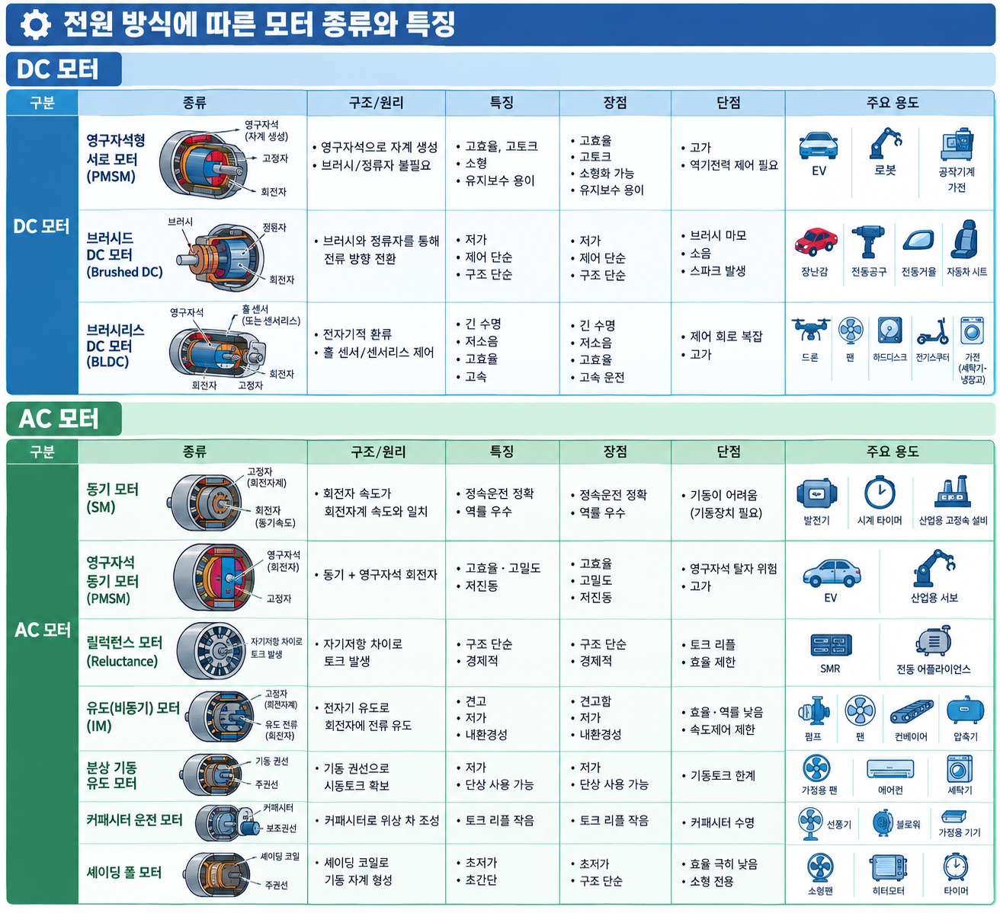
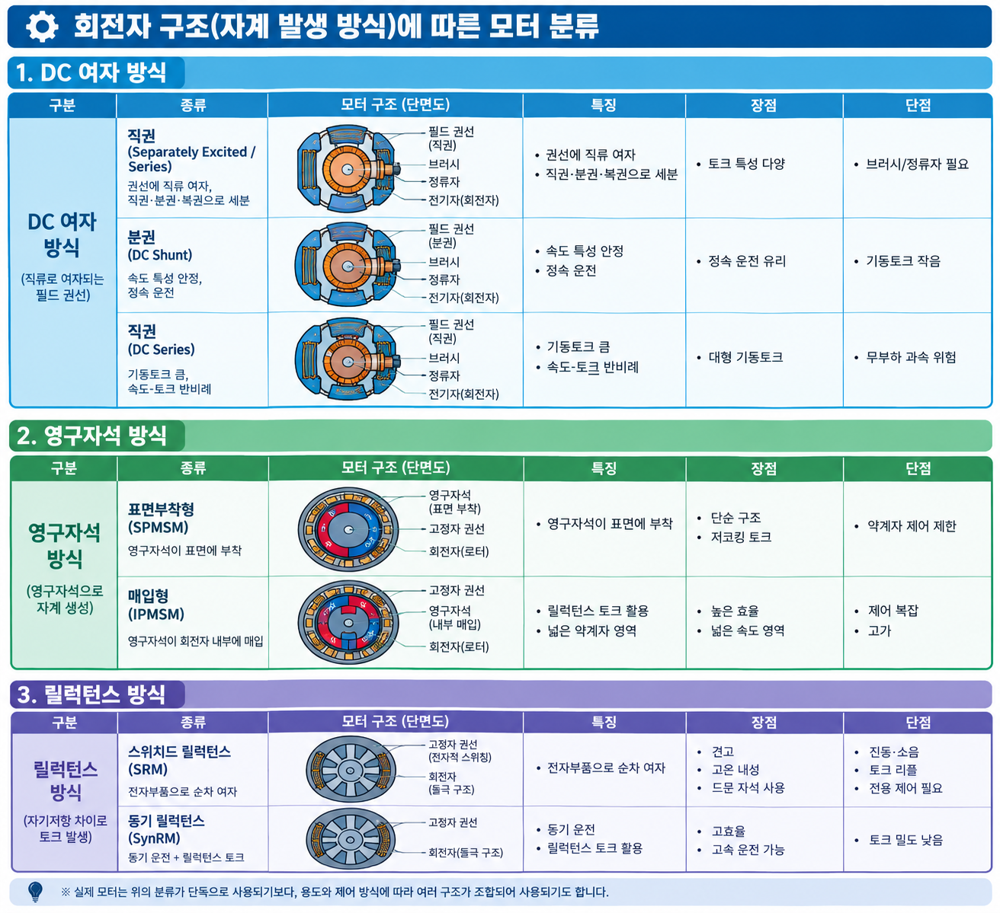

# 모터(Motor) 분류 및 특징 정리

## 1. 전원 방식에 따른 분류

| 구분 | 종류 | 특징 | 장점 | 단점 | 주요 용도 |
|------|------|------|------|------|-----------|
| **DC 모터** | 영구자석형 서로 모터(PMSM) | 영구자석으로 자계 생성, 브러시/정류자 불필요 | 고효율, 고토크, 소형, 유지보수 용이 | 고가, 역기전력 제어 필요 | EV, 로봇, 공작기계, 가전 |
| | 브러시드 DC 모터(Brushed DC) | 브러시와 정류자를 통해 전류 방향 전환 | 저가, 제어 단순, 구조 단순 | 브러시 마모, 소음, 스파크 발생 | 장난감, 전동공구, 전동거울, 자동차 시트 |
| | 브러시리스 DC 모터(BLDC) | 전자기적 환류, 홀 센서/센서리스 제어 | 긴 수명, 저소음, 고효율, 고속 | 제어 회로 복잡, 고가 | 드론, 팬, 하드디스크, 전기스쿠터, 가전(세탁기·냉장고) |
| **AC 모터** | 동기 모터(SM) | 회전자 속도가 회전자계 속도와 일치 | 정속운전 정확, 역률 우수 | 기동이 어려움(기동장치 필요) | 발전기, 시계 타이머, 산업용 고정속 설비 |
| | 영구자석 동기 모터(PMSM) | 동기 + 영구자석 회전자 | 고효율·고밀도, 저진동 | 영구자석 탈자 위험, 고가 | EV, 산업 고성능 서보 |
| | 릴럭턴스 모터(Reluctance) | 자기저항 차이로 토크 발생 | 구조 단순, 경제적 | 토크 리플, 효율 제한 | SMR, 전동 어플라이언스 |
| | 유도(비동기) 모터(IM) | 전자기 유도로 회전자에 전류 유도 | 견고, 저가, 내환경성 | 효율·역률 낮음, 속도제어 제한 | 산업용 펌프, 팬, 컨베이어, 압축기 |
| | 분상 기동 유도 모터 | 기동 권선으로 시동토크 확보 | 저가, 단상 사용 가능 | 기동토크 한계 | 가정용 팬, 에어컨, 세탁기 |
| | 커패시터 운전 모터 | 커패시터로 위상 차 조성 | 토크 리플 작음 | 커패시터 수명 | 가정용 기기(선풍기·블로워) |
| | 셰이딩 폴 모터 | 셰이딩 코일로 기동 자계 형성 | 초저가, 초간단 | 효율 극히 낮음, 소형 전용 | 소형팬, 히터모터, 타이머 |

## 2. 회전자 구조(자계 발생 방식)에 따른 분류

| 구분 | 종류 | 특징 | 장점 | 단점 |
|------|------|------|------|------|
| **DC 여자 방식** | 직권(Separately Excited / Series) | 권선에 직류 여자, 직권·분권·복권으로 세분 | 토크 특성 다양 | 브러시/정류자 필요 |
| | 분권(DC Shunt) | 속도 특성 안정, 정속 운전 | 정속 운전 유리 | 기동토크 작음 |
| | 직권(DC Series) | 기동토크 큼, 속도-토크 반비례 | 대형 기동토크 | 무부하 과속 위험 |
| **영구자석 방식** | 표면부착형(SPMSM) | 영구자석이 표면에 부착 | 단순, 저코깅 토크 | 약계자 제어 제한 |
| | 매입형(IPMSM) | 영구자석이 회전자 내부에 매입 | 릴럭턴스 토크 활용, 넓은 약계자 영역 | 제어 복잡, 고가 |
| **릴럭턴스 방식** | 스위치드 릴럭턴스(SRM) | 전자부품으로 순차 여자 | 견고, 고온 내성, 드문 자석 사용 | 진동·소음, 토크 리플, 전용 제어 필요 |
| | 동기 릴럭턴스(SynRM) | 동기 운전 + 릴럭턴스 토크 | 고효율, 고속 운전 가능 | 토크 밀도 낮음 |

## 3. 특수/고성능 모터

| 종류 | 특징 | 장점 | 단점 | 주요 용도 |
|------|------|------|------|-----------|
| **서보 모터(Servo)** | 위치·속도·토크 폐루프 제어 | 정밀 제어, 고응답성 | 고가, 제어기 필요 | CNC, 로봇, 포장기계, 프린터 |
| **스테퍼 모터(Stepper)** | 펄스 신호로 이산(계단) 회전 | 개루프 위치제어 용이, 저가 | 저속·저토크, 소음·진동, 스텝 손실 가능 | 3D 프린터, 카메라 렌즈, ATM, 의료기기 |
| **리니어 모터(Linear)** | 회전 대신 직선 운동 직접 발생 | 백래시 없음, 고속·고정밀 | 고가, 설치 면적 큼 | 리프트(LMG), 반도체 이송, 자기부상열차 |
| **초음파 모터(USM)** | 초음파 진동을 마찰로 변환 | 저속대형 토크, 무전자기 간섭, 소형 | 마모, 수명 제한, 고가 | 카메라 렌즈, 시계 기구, 의료 기구 |
| **브러시리스 AC 서보** | BLDC 기반 서보 제어 | 고효율·정밀 | 고가 | 산업용 서보 전반 |
| **토크 모터(Torque Motor)** | 저속·대토크 직접 구동 | 감속기 불필요, 백래시 제거 | 방열 문제, 고가 | 턴테이블, 지게차 휠, 마그네트론 |

## 4. 용도 특화 모터

| 종류 | 특징 | 주요 용도 |
|------|------|-----------|
| **유니버설 모터(Universal)** | AC/DC 겸용, 직권 특성, 고속·고토크 | 가정용 믹서, 청소기, 전동공구 — 고속 회전이 필요한 소형 가전 |
| **기어드 모터(Geared)** | 감속기 일체형, 저속·고토크 출력 | 컨베이어, 자동 개폐장치 |
| **관성/플라이휠 모터** | 회전 질량의 관성 활용 | 에너지 저장, 자이로 |
| **액추에이터용 모터** | 정밀 직선/각도 구동 | 밸브, 댐퍼, 로봇 관절 |

## 5. 기동 방식에 따른 분류 (주: 3상 유도 전동기)

| 기동 방식 | 특징 | 장점 | 단점 |
|-----------|------|------|------|
| 직입 기동(DOL) | 전압 직접 인가 | 단순, 저비용 | 기동전류 큼(5~8배) |
| Y-Δ 기동 | 기동 시 Y, 정격 시 Δ | 기동전류 1/3 수준 | 660V 이상·높은 부하기동 제한 |
| 리액터 기동 | 리액터로 전압 강하 | 전류·토크 제어 | 구조 복잡 |
| 소프트 스타터 | 전자식 전압 램프 제어 | 부드러운 기동·감속 | 고가 |
| 인버터(VFD) 기동 | 주파수·전압 가변 제어 | 전 구간 속도제어, 고효율 | 고가, 고조파 발생 |

## 6. 제어 방식에 따른 분류

| 제어 방식 | 특징 | 장점 | 단점 |
|-----------|------|------|------|
| 스텝 제어(개루프) | 펄스 수로 위치 결정 | 단순, 저가 | 스텝 손실 가능 |
| FOC(벡터 제어) | 자속·토크 분리 독립 제어 | 고성능, 정밀 토크제어 | 제어 알고리즘 복잡 |
| DTC(직접 토크 제어) | 토크·자속 직접 뱅뱅 제어 | 빠른 응답, 로버스트 | 토크 리플, 가변 스위칭 주파수 |
| 센서리스 제어 | 역기전력·자속 추정 | 센서 제거, 비용 절감 | 저속 성능 저하 |
| PWM(전압 제어) | 전압 펄스 폭 변조 | 효율적 전력 제어 | 고조파, 스위칭 손실 |

## 7. 모터 구성 요소별 비교 요약

| 요소 | 브러시드 DC | BLDC | 유도(AC) | PMSM | SRM |
|------|------------|------|----------|------|-----|
| 브러시/정류자 | 있음 | 없음 | 없음 | 없음 | 없음 |
| 영구자석 | 있음 | 있음 | 없음 | 있음 | 없음 |
| 제어 복잡도 | 낮음 | 중간 | 낮음~중간 | 높음 | 높음 |
| 효율 | 낮음~중간 | 높음 | 중간 | 높음 | 중간 |
| 수명 | 짧음(브러시 마모) | 매우 김 | 김 | 김 | 김 |
| 단가 | 낮음 | 중간 | 낮음 | 높음 | 중간 |
| 소음/진동 | 높음 | 낮음 | 중간 | 낮음 | 높음(토크 리플) |

---

### 핵심 요약
- **저가·간단**: 브러시드 DC, 셰이딩 폴, 유도 모터
- **고효율·고성능**: BLDC, PMSM, 서보 모터
- **정밀 위치 제어**: 스테퍼, 서보, 리니어 모터
- **극한 환경/내구성**: SRM, 유도 모터
- 최근 추세: 영구자석 소재 고가화로 **SynRM**, **SRM**, **유도 모터** 등 자석 프리(rare-earth-free) 모터 연구 증가
